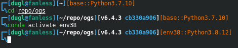

#  Imp-extended themes

Themes based on [Imp](https://github.com/igormp/Imp) to provide more prompt symbol options.
File imp.zsh-theme is Igor Moura's original one, which I used as a template.

20221014: Beautiful Conda env and Python version info support was added. It's after the Git info on the first prompt line. This feature is based on [taw-ys.zsh-theme](https://github.com/lyytaw/taw-ys.zsh-theme). These new themes work correctly even if there exists no Conda.



## Installation

1. Follow the [oh-my-zsh instructions](https://github.com/robbyrussell/oh-my-zsh/wiki/Customization#overriding-and-adding-themes) to install oh-my-zsh;
2. Follow the [Imp instructions](https://github.com/igormp/Imp) to install and configure the Imp theme;
3. And then run the following to install more prompt options:
```
mkdir -p $ZSH_CUSTOM/themes &&
for s1 in ampersand asterisk at-sign close-brace close-bracket close-parenthesis colon dollar exclamation-mark greater-than hash less-than open-brace open-bracket open-parenthesis percent-sign pipe plus question-mark semicolon tilde; do curl https://raw.githubusercontent.com/GuanglinDu/Imp-extended/master/imp-"$s1".zsh-theme -L -o "$ZSH_CUSTOM"/themes/imp-"$s1".zsh-theme; done
```
Then set the theme in your **.zshrc** file. By default, the pipe theme is selected.
Modify according to your case.

```
#ZSH_THEME="imp"
#ZSH_THEME="imp-ampersand"
#ZSH_THEME="imp-asterisk"
#ZSH_THEME="imp-at-sign"
#ZSH_THEME="imp-close-brace"
#ZSH_THEME="imp-close-bracket"
#ZSH_THEME="imp-close-parenthesis"
#ZSH_THEME="imp-colon"
#ZSH_THEME="imp-dollar"
#ZSH_THEME="imp-exclamation-mark"
#ZSH_THEME="imp-greater-than"
#ZSH_THEME="imp-hash"
#ZSH_THEME="imp-less-than"
#ZSH_THEME="imp-open-brace"
#ZSH_THEME="imp-open-bracket"
#ZSH_THEME="imp-open-parenthesis"
#ZSH_THEME="imp-percent-sign"
ZSH_THEME="imp-pipe"
#ZSH_THEME="imp-plus"
#ZSH_THEME="imp-question-mark"
#ZSH_THEME="imp-semicolon"
#ZSH_THEME="imp-tilde"
```

4. To support Conda env and Python version info elegantly, install the imp-conda*.zsh-themes. Five themes are available at present: imp-conda, imp-conda-dollar, imp-conda-has, imp-conda-percent-sign, and imp-conda-pipe.
```
mkdir -p $ZSH_CUSTOM/themes &&
curl https://raw.githubusercontent.com/GuanglinDu/Imp-extended/master/imp-conda.zsh-theme -L -o "$ZSH_CUSTOM"/themes/imp-conda.zsh-theme &&
for s1 in conda-dollar conda-hash conda-percent-sign conda-pipe; do curl https://raw.githubusercontent.com/GuanglinDu/Imp-extended/master/imp-"$s1".zsh-theme -L -o "$ZSH_CUSTOM"/themes/imp-"$s1".zsh-theme; done
```
Then set the theme in your **.zshrc** file. By default, the pipe theme is selected.
Modify according to your case.

```
#ZSH_THEME="imp"
#ZSH_THEME="imp-dollar"
#ZSH_THEME="imp-hash"
ZSH_THEME="imp-percent-sign"
#ZSH_THEME="imp-pipe"
```

In your ~/.condarc (create if it doesnt' exist), add the following line to disable Conda to change the environment varible PS1.
```
changeps1: False
```

Enjoy a slew of the elegant Oh-my-zsh prompt themes every beautiful day!
